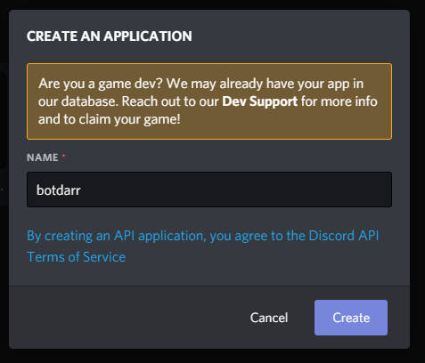
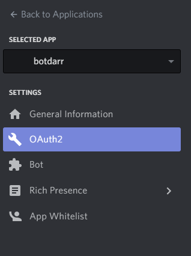
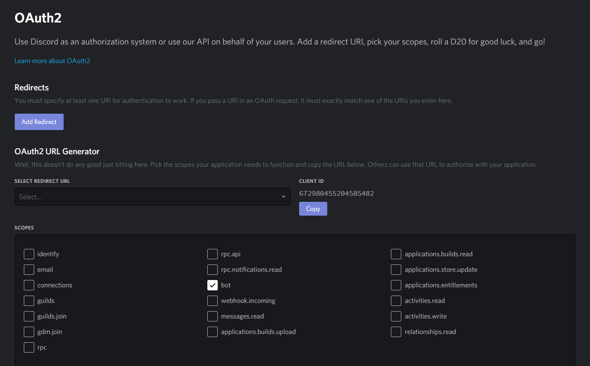
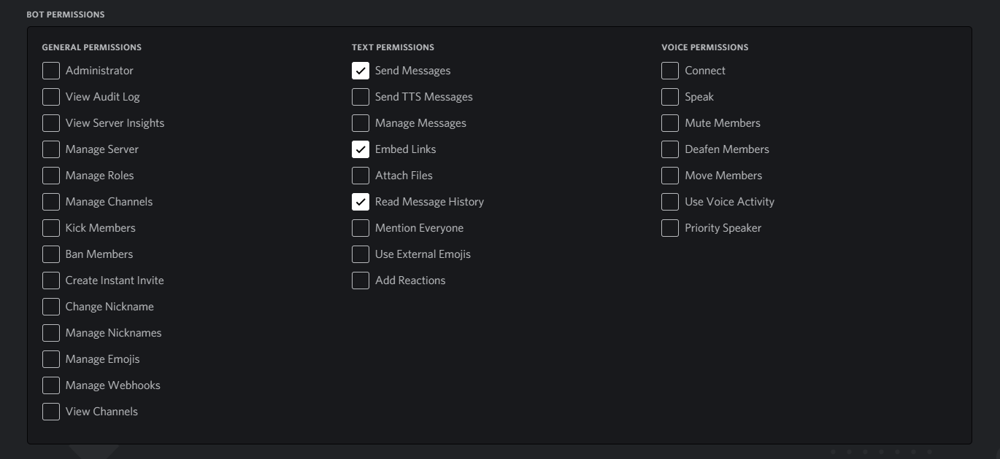
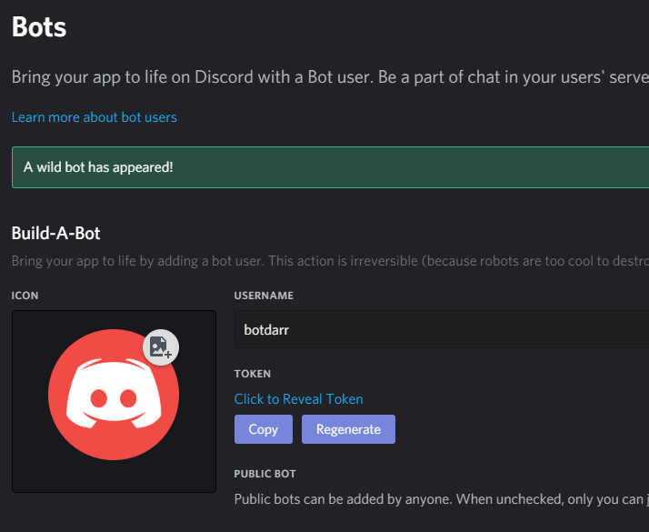
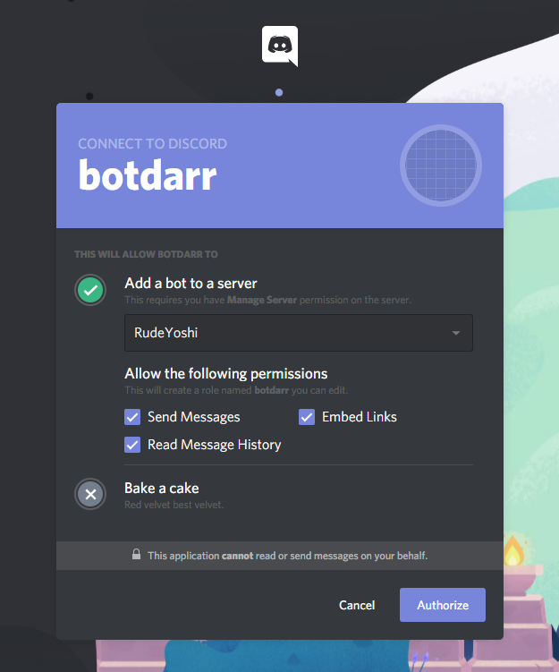

# Summary

Made this simple slack/discord bot so I could access radarr, sonarr, and lidarr (not implemented yet) all from a multiple slack/discord channels

<br/>

## Currently Supported API's

- [x] Radarr (v2)
- [ ] Radarr (v3)
- [ ] Sonarr (v2)
- [x] Sonarr (v3)
- [ ] Lidarr

## Currently Supported Chat Client's

- [x] Discord
- [x] Slack
- [ ] Telegram

<br/>

## Discord Bot Installation

Follow instructions here https://discordpy.readthedocs.io/en/latest/discord.html or instructions below

1. Go to https://discordapp.com/developers/applications (if you don't have an account yet, you'll need to make one)
1. Click "New Application"

1. After the application has been made, click "OAuth2"

1. Check the "bot" scope in the OAuth2 page

1. Then check the following text permissions; Send Messages, Embed Links, Read Message History

1. Once you've selected permissions and scope, copy the url at the bottom of the scopes menu somewhere for now

1. Next click the "Bot" menu option

1. Next click Add Bot (click ok on confirmation windows after clicking add)

1. Next you should have your Bots filled with details about your bot, click "Click to reveal token", and save this token later when you make your properties file

1. Take the link from step#6 and copy it into a browser. Once you do this, you will be able to authorize which discord server you want to add the bot to

1. Next on your discord you need to add the bot user to different text channels (the text channels here are used specified in the properties file in the "discord-channels" property)
1. Once you've added the bot to a channel, then you can start botdar and see your bot appear in the members list.

## Slack Bot Installation

https://api.slack.com/apps
* The simplest permission setup is to have the "bot" OAuth Scope. Which seems only available in api.slack.com when you install the app from the wizard
* Once you add a slack app to a channel, make sure you tag your bot user in that channel. Otherwise I've noticed events and messages don't post
<br/>

## Manual Installation

1. Get latest copy of botdarr botdarr-release.jar
1. Make sure you have openjdk 8 or oracle java 8 installed on your machine
1. Create a file called "properties" (without double quotes) in same folder as the jar
1. Fill it with the following properties (you can omit sonarr properties if you aren't using it, same with radarr, however everything else listed below is required)
1. You can only configure discord or slack token/channels, otherwise you will get an error during startup
```
# your discord bot token
discord-token=
# the discord channel(s) you want the bot installed on
discord-channels=

# your slack bot token (the both user oauth access token, not the oauth access token)
slack-token=xoxb-*
# the slack channel(s) you want the bot installed on
slack-channels=

# your radarr url (i.e., http://SOME-IP:SOME-PORT)
radarr-url=
# your radarr token (go to Radarr->Settings->General->Security->Api Key)
radarr-token=
# the root path your radarr movies get added to
radarr-path=
# the default quality profile you want to use (go to Radarr->Settings->Profiles)
radarr-default-profile=

# your radarr url (i.e., http://SOME-IP:SOME-PORT)
sonarr-url=
# your sonarr token (go to Sonarr->Settings->General->Security->Api Key)
sonarr-token=
# the root path your sonarr shows get added to
sonarr-path=
# the default quality profile you want to use (go to Sonarr->Settings->Profiles)
sonarr-default-profile=any
```

1. Run the jar using java
```
nohup java -jar botdarr-release.jar &
```
<br/>

## Run with Docker

1. Docker images are here https://cloud.docker.com/repository/docker/shayaantx/botdarr/general
1. Create a folder on your host called "botdarr"
1. Create a logs folder in the botdarr folder
1. Put your properties file in botdarr folder inside a folder named "config"
1. Then run below command (replace BOTDARR_HOME variables)
```
# for latest
docker run -d --name botdarr -v /BOTDARR_HOME/properties:/home/botdarr/config/properties -v /BOTDARR_HOME/logs:/home/botdarr/logs shayaantx/botdarr:latest &

# for stable

docker run -d --name botdarr -v /BOTDARR_HOME/properties:/home/botdarr/config/properties -v /BOTDARR_HOME/logs:/home/botdarr/logs shayaantx/botdarr:stable &
```

Or if you want to use docker-compose

```
version: '2.2'
botdarr:
    image: shayaantx/botdarr:latest
    container_name: botdarr
    volumes:
       - /BOTDARR_HOME/properties:/home/botdarr/config/properties
       - /BOTDARR_HOME/logs:/home/botdarr/logs
```


<br/>

## Usage

* Type help in discord to get information about commands and what is supported
* Type movies help in discord to get information about movie commands
* Every minute notifications will appear indicating the current downloads, their status, and their time remaining.

<br/>

## Radarr Tips

1. Just cause you add a movie successfully does not mean the movie will show up instantly or at all
   - The way radarr works is you search for a film, then add it, then radarr will start searching through all the configured indexers for a torrent
   - that matches the configure quality profiles the admin user has set. i.e., if there is only a CAM version of the film you want out there
   - but the master user of radarr has configured to disallow CAM quality, then it will not download.
   - If you use "movie find downloads TITLE" or "movie find all downloads TITLE" it can show you the downloads available through radarr for your requested/existing film.
   - Although this functionality is not complete yet, as movies with similar titles will conflict and not show you downloads.
   - I also need to somehow add functionality to let you force specific downloads as well.

2. movie title add
   - This command will specifically try to add a movie based on title alone. Sometimes there are movies that have same titles or very similar titles
   - When the title cannot be added by title alone, multiple movies will be returned. Embedded in the results is a command to add the movie with an id
   - The command will look something "movie add John Wick: Chapter 4 603692". This command uses the movie title plus the TMDBID to add the movie

3. movie profiles
   - and this profile is used when identifying downloads.
   - This command shows you all the profiles available in radarr, it does NOT tell you which is the default profile. The default profile is configured by the bot admin
   - and this profile is used when identifying downloads.

4. movie find new
   - This command uses radarr search api to identify new films.
   - Embedded in the results are commands to add the films directly, like "movie add Ad Astra 570820"

5. movie find existing
   - This command finds any existing films and gives you information about them.
   - It will tell you if the movie has been downloaded and if the radarr has the file.


## Sonarr Tips

1. Just like radarr, when you add a show with sonarr it doesn't automatically mean the show will magically appear. It really depends
  - on how many trackers your sonarr installation has and how diverse the content within said trackers is.

TODO: need to add more tips for sonarr  
  
<br/>

## Stuff I might add in the future

1. Interactive season search/download (only available in v3 sonarr)
2. Per episode search/download
3. Cancelling/blacklisting downloads (movies and tvshows)
4. When I implement lidarr support I want to search by song instead of just artist/album (since lidarr doesn't support song search)